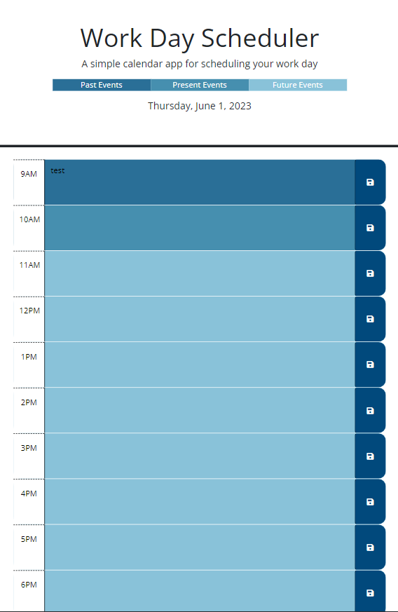

# WorkDayScheduler

## Description

The Work Day Scheduler can be accessed at the following URL: https://hannahmidd.github.io/WorkDayScheduler/

This work day scheduler will allow a users to to save events for each hour of the day. Users will be able to view events that are past, present and future to stay on track for the day. Follow the usage instructions below to learn more.  

## Installation

N/A

## Usage

Once you have opened the calendar URL, click on the hour box that you would like to create an event for. 

Type in your event details and click the blue "save" icon on the right of your text. 

YYou will notice an alert "Appointment Added to localStorage✔️", meaning that you can come back to this page at any point today to access these details. 

The past events, present events, and future events will be color coded to help users easily asses where they are at in the day. 

Enjoy your new calendar!

## Credits

N/A

## License

Please refer to the LICENSE in the repo.